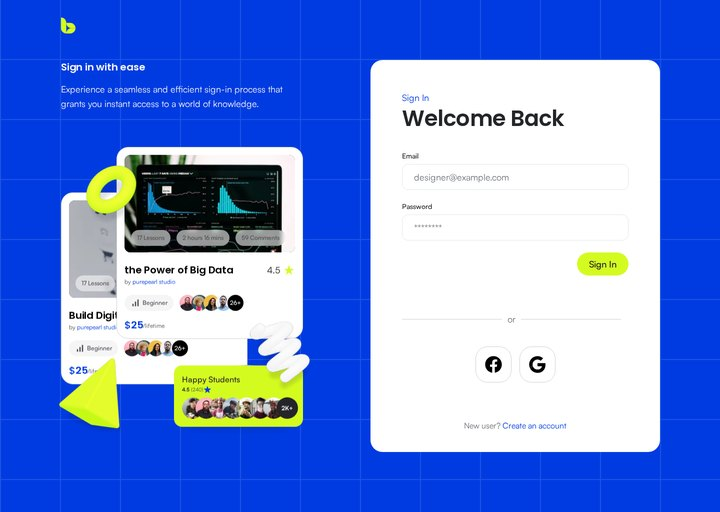
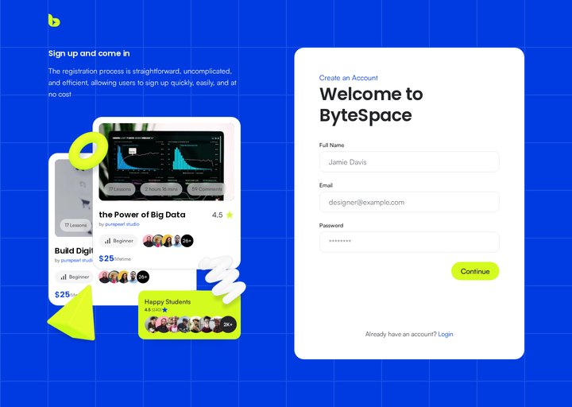

# ByteSpace

A pixel-perfect, responsive and animated build of the **ByteSpace** online-courses website from the
provided Figma design: the landing page (required) plus the Login and Register pages (bonus).

**Live demo: [bytespace-himel.vercel.app](https://bytespace-himel.vercel.app)** · **Pull requests:**
[#1 Landing page](https://github.com/himelahmed404/bytespace/pull/1) ·
[#2 Login & Register](https://github.com/himelahmed404/bytespace/pull/2)


| Login                                     | Register                                        |
| ----------------------------------------- | ----------------------------------------------- |
|  |  |

## Highlights

- **Pixel-perfect at 1440px.** Every page was checked against its Figma frame with an automated
  pixel diff. The remaining differences are mostly font anti-aliasing and the intentional changes
  listed [below](#intentional-changes-from-the-figma-file).

  | Page             | Figma frame | Pixels that differ |
  | ---------------- | ----------- | ------------------ |
  | Home (full page) | 1440 × 6377 | 1.87%              |
  | Login            | 1440 × 1024 | 1.31%              |
  | Register         | 1440 × 1024 | 1.42%              |
  | 404              | 1440 × 1024 | 1.37%              |

- **Responsive from 375px to 1920px**, with no horizontal scroll at any width. There's a mobile menu,
  swipeable testimonials on phones, and the hero collage scales down as one piece.
- **Animated, but light.** The floating 3D shapes and cards use CSS keyframes (GPU transforms only).
  [Motion](https://motion.dev) handles the scroll reveals, course filtering, count-up stats, the
  "liquid" search button and the sticky header. All of it switches off when the OS asks for reduced motion.
- **Accessible:**
  - semantic landmarks and a skip link
  - one `<h1>` per page
  - visible focus rings
  - WCAG AA text contrast
  - labelled form fields whose errors are announced to screen readers
- **Fast.** Lighthouse scores for the production build (Performance / Accessibility / Best Practices / SEO):

  | Page     | Desktop               | Mobile               |
  | -------- | --------------------- | -------------------- |
  | Home     | 98 / 100 / 100 / 100  | 89 / 100 / 96 / 100  |
  | Login    | 100 / 100 / 100 / 100 | 97 / 100 / 100 / 100 |
  | Register | 100 / 100 / 100 / 100 | 97 / 100 / 100 / 100 |

  Measured with Lighthouse 12 on the production build. On desktop the live site scores within a point
  of these numbers. Mobile performance depends on the network and device, so a real connection can
  score lower. On mobile, the home page's 96 comes from the resolution of the source images in the
  design file.

## Tech stack

| Area      | Choice                                                                                       |
| --------- | -------------------------------------------------------------------------------------------- |
| Framework | [Next.js 16](https://nextjs.org) (App Router, every page statically prerendered)             |
| Language  | TypeScript (strict)                                                                          |
| Styling   | [Tailwind CSS v4](https://tailwindcss.com); the design tokens live in `@theme`               |
| Animation | CSS keyframes + [Motion](https://motion.dev) (`motion/react`)                                |
| Fonts     | Poppins (`next/font/google`); Satoshi and Clash Display self-hosted (`next/font/local`)      |
| Quality   | ESLint, Prettier (with Tailwind class sorting), a Playwright + pixelmatch visual-diff script |
| Hosting   | Vercel                                                                                       |

## Getting started

Requires Node.js 20.9 or later.

```bash
npm install
npm run dev        # http://localhost:3000
```

| Script                | What it does                                          |
| --------------------- | ----------------------------------------------------- |
| `npm run dev`         | Start the development server                          |
| `npm run build`       | Create the production build                           |
| `npm start`           | Serve the production build                            |
| `npm run lint`        | Run ESLint                                            |
| `npm run typecheck`   | Generate route types and run the TypeScript checker   |
| `npm run format`      | Format everything with Prettier                       |
| `npm run visual-diff` | Compare a page region with a Figma export (see below) |

```bash
# With the dev server running: diff the hero against a 1:1 Figma export
npm run visual-diff -- --ref hero.png --clip 0,0,1440,1024 --name hero
```

The script renders the page at 1440px with animations frozen. It writes a screenshot, a diff image
and an overlay to `.visual-diff/`, and prints the percentage of pixels that differ.

## Project structure

```
app/
  page.tsx               Landing page: composes the home sections
  login/  register/      Auth pages (bonus)
  not-found.tsx          Branded 404
  layout.tsx             Fonts, metadata, skip link, global SVG filters
  globals.css            Design tokens (@theme), keyframes, utilities
  fonts/                 Self-hosted Satoshi and Clash Display (with licence)
components/
  ui/                    Building blocks: Button, Pill, Logo, TextField, AvatarStack,
                         ProgressBar, SectionHeading, GridBackground, Ornament, SwipeList…
  cards/                 CourseCard, HappyStudentsCard, ProgressCard, TestimonialCard…
  motion/                Float, RiseIn, Reveal/RevealGroup, FloatingCard, FloatingOrnament
  home/                  One component per landing-page section (Hero, DiscoverCourses…)
  auth/                  AuthLayout, AuthShowcase, LoginForm, RegisterForm, FormStatus
  footer/                SiteFooter, NewsletterForm, FooterLink
  SiteHeader.tsx  StickyHeader.tsx  MobileMenu.tsx
lib/
  data.ts                All page content (courses, categories, testimonials, links)
  validation.ts          Form validation rules shared by the auth forms
  navigation.ts  site.ts  courseFilter.ts  cn.ts
scripts/visual-diff.mjs  Pixel comparison against Figma exports
```

Content is kept apart from markup: sections render arrays from `lib/data.ts`. The same cards are
reused across pages. For example, `CourseCard` and `HappyStudentsCard` appear in the course grid,
the hero and the auth-page collage, switched by `variant` and `tone` props.

## Implementation notes

- **Line heights snapped the way Figma snaps them.** Figma rounds every line box to a whole pixel
  (18px × 1.6 = 28.8 → 29px). The type scale in `globals.css` uses those rounded values; otherwise
  sub-pixel drift adds up over the 6377px page.
- **Official font files.** The Fontshare CDN builds of Satoshi render about 3% wider than the
  official package, which changed where lines wrap. The package files are self-hosted instead.
  This also means no layout shift and no third-party request.
- **3D ornaments like Figma's layers.** Each shape is a grayscale render with a colour layer masked
  to it and blended with `mix-blend-hard-light`, so one render can take any brand tint.
  The floating cards' drop shadow is one SVG filter that merges the design's eight shadow layers.
- **Collages that scale without JavaScript.** The hero and growth collages are laid out on the Figma
  canvas and scaled to the available width in CSS: `tan(atan2(100cqw, <design width>))` turns
  container units into a plain number. There are no resize listeners and no layout shift.
- **LCP-friendly entrance.** The hero headline animates in with CSS starting from `opacity: 0.01`,
  not 0, because Chrome skips fully transparent elements when it picks the Largest Contentful Paint
  element. Waiting for JavaScript would push LCP back.
- **Liquid search.** As you type, the search button slides into the field and merges with it through
  an SVG "goo" filter (blur + alpha threshold), then pulses gently to invite a click.
- **Forms are UI only.** There's no backend in scope. The forms validate on submit, then re-validate
  as you type. Focus moves to the first invalid field. Errors are linked with `aria-describedby`,
  and the outcome is announced through a `role="status"` region. A demo success state stands in
  for the real request, and `// TODO: call the auth backend here` marks where it would go.

### Intentional changes from the Figma file

- The light secondary gray `#82868E` is darkened to `#70737A` so small text on white passes WCAG AA (4.5:1).
- Two copy typos in the footer are fixed ("Subscribe" and the "©" symbol).
- Floating elements cast a soft shadow that moves with them, for a subtle 3D effect.
- Added behaviour the static design doesn't cover:
  - a sticky header that reappears when you scroll up
  - swipeable testimonials on phones
  - a mobile menu
  - the responsive layouts below 1440px

## Git workflow

Nothing was committed directly to `main` after the initial scaffold. Every change was made on a
branch and merged through a pull request:

| Branch                 | Pull request                                                                 |
| ---------------------- | ---------------------------------------------------------------------------- |
| `feature/landing-page` | [#1 Landing page](https://github.com/himelahmed404/bytespace/pull/1)         |
| `feature/auth-pages`   | [#2 Login & Register](https://github.com/himelahmed404/bytespace/pull/2)     |
| `docs/readme`          | [#3 README and live link](https://github.com/himelahmed404/bytespace/pull/3) |

Commits follow the [Conventional Commits](https://www.conventionalcommits.org) style
(`feat(home): …`, `fix: …`, `docs: …`).

## Credits

- Design: the ByteSpace Figma file provided for this task.
- Fonts: [Satoshi](https://www.fontshare.com/fonts/satoshi) and
  [Clash Display](https://www.fontshare.com/fonts/clash-display) by Indian Type Foundry
  (ITF Free Font License, included in `app/fonts/`);
  [Poppins](https://fonts.google.com/specimen/Poppins) (SIL Open Font License).
